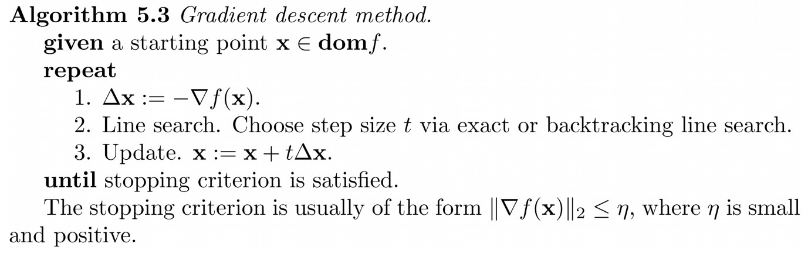
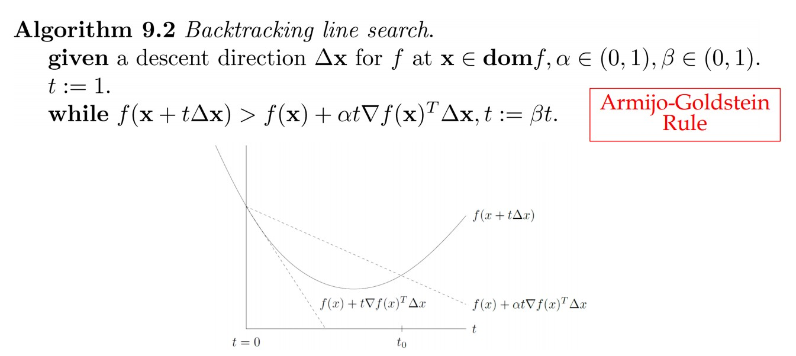

## Optimization algorithms

### Gradient Descent

Gradient descent algorithm with backtracking line search.

Example function:
$$f(x) = \sum_{i=1}^m[exp(a_i^Tx)+exp(-a_i^Tx)]$$

code: gradient_descent.py

Grid search for parameters: $\alpha, \beta$