## Optimization algorithms

### Gradient Descent

Gradient descent algorithm with backtracking line search.

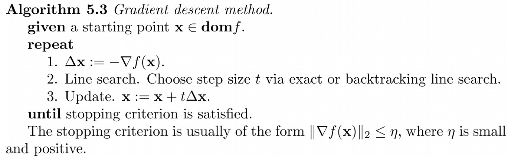
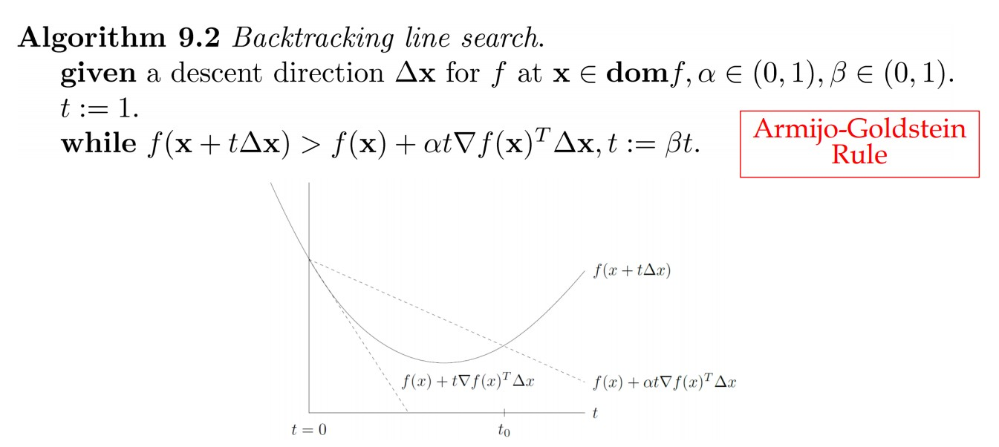

Example function:
$$f(x) = \sum_{i=1}^m[exp(a_i^Tx)+exp(-a_i^Tx)]$$

Code: gradient_descent.py

Grid search for parameters: $\alpha, \beta$ in $\{0.03, 0.1, 0.3, 0.5\}$

Take steps:

	[[70. 66. 28. 35.]
	 [70. 66. 28. 27.]
	 [74. 68. 27. 27.]
	 [82. 73. 29. 31.]]
So we choose $\alpha=\beta=0.3$ in the following experiments.

Plot figures:

* $\|\nabla f(\mathbf x)\|_2$

  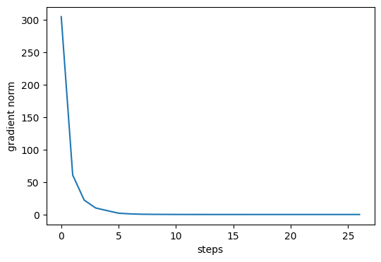

* step length

  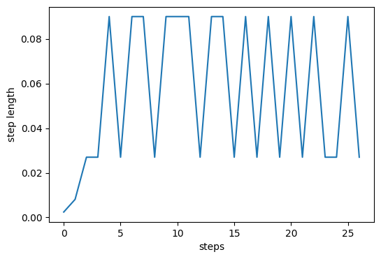

* $f-p*$

  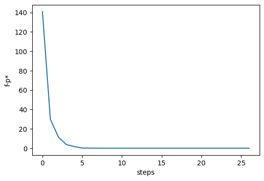

### Steepest Descent

Steepest descent algorithm in $l_\infty$-norm.

$\Delta\mathbf{x}_{nsd}=\arg\min_\mathbf{v}\{\nabla f(\mathbf{x})^T\mathbf{v}|\|\mathbf{v}\|_\infty=1\}$

Set $\Delta{\mathbf{x}_{i}} = -sign(\nabla f(\mathbf{x})_i)$ if $i = \arg\max_i\|\nabla f(\mathbf{x})_i\|$.

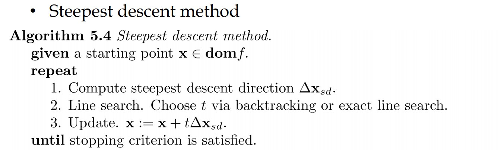

Example function:
$$f(x) = \sum_{i=1}^m[exp(a_i^Tx)+exp(-a_i^Tx)]$$

Code: steepest_descent.py

```python
grad = grad_func(x)
dir = np.zeros(grad.shape)
i = np.argmax(np.abs(grad))
dir[i] = -grad[i]
```

Grid search for parameters: $\alpha, \beta$ in $\{0.03, 0.1, 0.3, 0.5\}$

Take steps:

	[[207. 404.  80.  74.]
	 [207. 404.  82.  53.]
	 [228. 502. 159.  49.]
	 [237. 719. 161. 149.]]

So we choose $\alpha=0.1,\beta=0.5$ in the following experiments.

Plot figures:

* $\|\nabla f(\mathbf x)\|_2$

  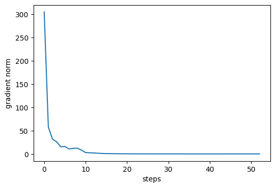

* step length

  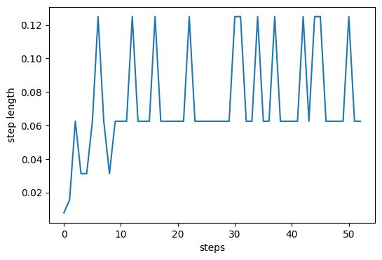

* $f-p*$

  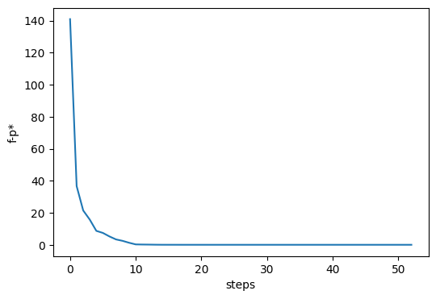

### Newton Methods

#### Damped Newton Method

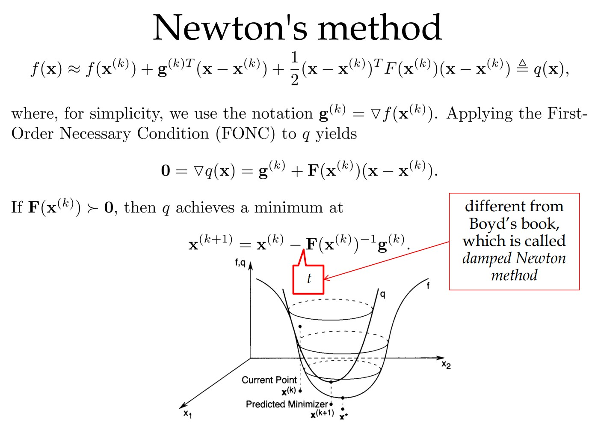

Example function:
$$f(\mathbf{x}) = 100(x_2-x_1^2)^2+(1-x_1)^2$$

Code: newton.py

Grid search for parameters: $\alpha, \beta$ in $\{0.03, 0.1, 0.3, 0.5\}$

Take steps:

	[[223.  79.  25.  24.]
	 [227.  81.  25.  25.]
	 [243.  89.  27.  25.]
	 [295. 103.  44.  26.]]

So we choose $\alpha=0.03,\beta=0.5$ in the following experiments.

Plot figure:

* $log(f(\mathbf{x}^{(k)})-p^*)$

  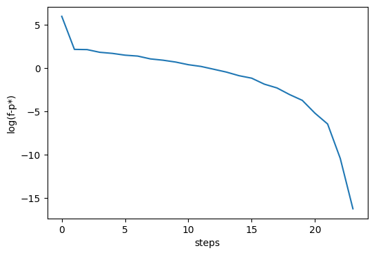

From the figure, we can see that damped newton method converges fast when it is close to the optimal solution.

Damped Newton time: 0.0020020008087158203s

#### Gauss-Newton Method

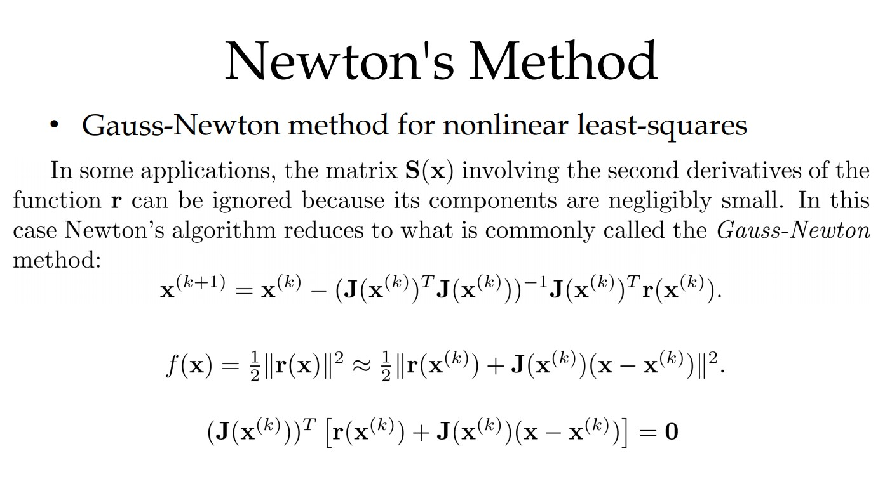

```python
dir = -solve_linear(np.dot(J(x).T, J(x)), np.dot(J(x).T, r(x)))
```

Gauss-Newton time: 0.0s

The algorithm converges in 3 steps.

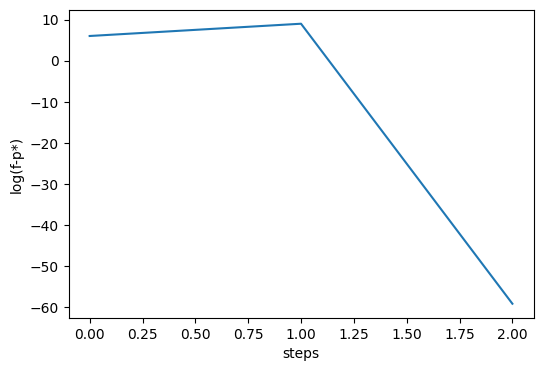